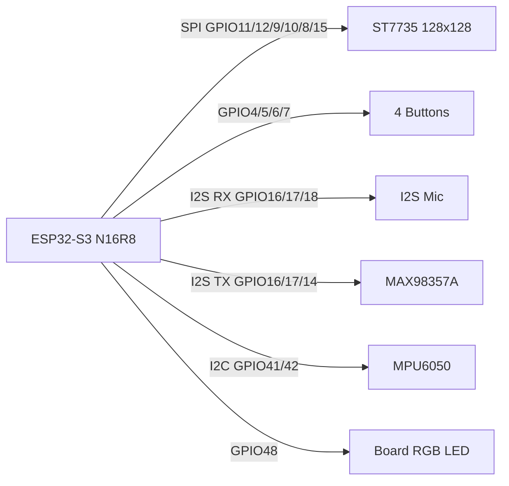

# 硬件接线

本项目默认使用 ESP32-S3 N16R8、128x128 ST7735、四个按键、I2S 麦克风、MAX98357A 喇叭功放、MPU6050 和板载 RGB LED。

## 总览

## ST7735 屏幕

| 屏幕引脚 | ESP32-S3 |
| --- | --- |
| LED | GPIO15 |
| SCL/SCK | GPIO12 |
| SDA/MOSI | GPIO11 |
| DC/RS | GPIO9 |
| CS | GPIO10 |
| RST | GPIO8 |
| VCC | 3.3V |
| GND | GND |

## 按键

按键一端接 GPIO，一端接 GND。固件使用内部上拉，按下为低电平。

| 按键 | ESP32-S3 |
| --- | --- |
| P4 | GPIO4 |
| P5 | GPIO5 |
| P6 | GPIO6 |
| P7 | GPIO7 |

## I2S 麦克风

| 麦克风信号 | ESP32-S3 |
| --- | --- |
| BCLK | GPIO16 |
| WS/LRCLK | GPIO17 |
| SD/DOUT | GPIO18 |
| VCC | 3.3V |
| GND | GND |

## MAX98357A 喇叭功放

| MAX98357A | ESP32-S3 |
| --- | --- |
| BCLK | GPIO16 |
| LRC/WS | GPIO17 |
| DIN | GPIO14 |
| VIN | 3.3V 或 5V，按模块规格选择 |
| GND | GND |

## MPU6050

| MPU6050 | ESP32-S3 |
| --- | --- |
| VCC | 3.3V |
| GND | GND |
| SCL | GPIO41 |
| SDA | GPIO42 |
| INT | 可选 GPIO13 |
| XDA | 不接 |
| XCL | 不接 |
| ADC | 不接 |
