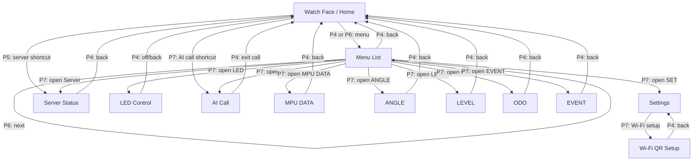
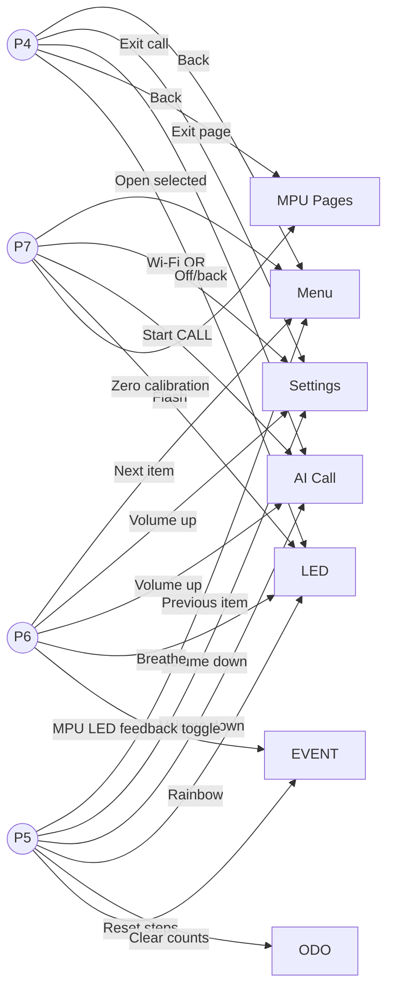

# ESP32-S3 UI Flow Blueprint

This document is the migration blueprint for rebuilding the current hand-coded UI in a visual UI tool such as EEZ Studio/EEZ Flow.

## Goals

- Replace page-specific hard-coded button logic with a consistent page state machine.
- Keep the 128x128 screen readable by using stable layouts and partial refresh for live values.
- Make page transitions visible as a graph before rebuilding screens in LVGL/EEZ Studio.
- Separate UI rendering from hardware/service logic.

## Global Controls

| Button | Global intent | Notes |
| --- | --- | --- |
| P4 | Back / exit current page | Voice call uses P4 to exit call mode. |
| P5 | Previous / decrease / reset | Depends on active page. |
| P6 | Next / increase / toggle | Depends on active page. |
| P7 | OK / confirm / call / calibrate | Depends on active page. |

## Page Graph



## Button Logic Graph



## Current Pages

| Page | Current render function | Live data | Preferred EEZ screen |
| --- | --- | --- | --- |
| Home | `renderWatchFace()` | time, weather, CPU, memory, Wi-Fi | `screen_home` |
| Menu | `renderMenuPage()` | selected item | `screen_menu` |
| Settings | `renderSettingsPage()` | volume, Wi-Fi, version | `screen_settings` |
| Wi-Fi QR | `renderWifiSetupPage()` | portal AP and QR | `screen_wifi_setup` |
| Server | `renderServerStatus()` | load, memory, disk, uptime | `screen_server` |
| LED | `renderLightPage()` | LED mode | `screen_led` |
| AI Call | `renderVoicePage()` | call state, volume, transcript bitmap | `screen_ai_call` |
| MPU DATA | `renderMpuPage()` | accel, gyro, temperature | `screen_mpu_data` |
| ANGLE | `renderAnglePage()` | roll, pitch, yaw rate | `screen_angle` |
| LEVEL | `renderLevelPage()` | bubble x/y | `screen_level` |
| ODO | `renderOdometerPage()` | steps, distance, motion | `screen_odometer` |
| EVENT | `renderMotionPage()` | state, counts, LED feedback | `screen_motion_event` |

## State Model

The firmware now uses a single page state instead of page booleans:

```cpp
enum class UiPage : uint8_t {
  Watch,
  Menu,
  Voice,
  Server,
  Light,
  Settings,
  WifiSetup,
  MpuData,
  MpuLevel,
  MpuAngle,
  Odometer,
  MpuMotion,
};
```

Recommended shared model variables:

| Variable | Type | Owner |
| --- | --- | --- |
| `currentUiPage` | `UiPage` | UI router |
| `menuSelectedIndex` | `uint8_t` | menu screen |
| `speakerVolumePercent` | `int` | audio/settings |
| `voiceStatus` | enum/string | voice service |
| `voiceCallMode` | bool | voice service |
| `ledMode` | enum | LED service |
| `mpuData` | struct | MPU service |
| `mpuCalibration` | struct | MPU service |
| `weather` | struct | weather service |
| `serverStatus` | struct | server service |

## EEZ Studio Mapping

Use EEZ screens for layout and EEZ Flow actions for navigation.

Suggested EEZ assets:

- `screen_home`: watch face arcs, time labels, weather labels.
- `screen_menu`: list with selected item highlight.
- `screen_ai_call`: call status, mic animation, transcript/reply area, volume indicator.
- `screen_mpu_*`: common top bar and bottom button bar, different content panels.
- `screen_wifi_setup`: QR code object plus AP/IP labels.

Suggested EEZ actions:

| Action | Trigger | Effect |
| --- | --- | --- |
| `go_home` | P4 on most screens | set `uiPage = Home` |
| `menu_prev` | P5 on menu | decrement selected item |
| `menu_next` | P6 on menu | increment selected item |
| `menu_open` | P7 on menu | open selected page |
| `start_call` | P7 on AI page | start voice call mode |
| `stop_call` | P4 on AI page | stop voice call mode |
| `mpu_calibrate` | P7 on MPU pages | save current MPU zero |
| `event_toggle_led` | P6 on EVENT | toggle MPU event LED feedback |

## Refactor Steps

1. Done: add `UiPage` and keep old render functions, replacing page booleans.
2. Done: add a central `dispatchButton(index)` function.
3. In progress: move each page's static layout and dynamic refresh into separate functions.
   - Done: AI call page frame/content split, recording timer now refreshes only the content area.
   - Done: menu page frame/list split, selection changes redraw only affected rows when the window does not scroll.
   - Existing: MPU pages use dynamic refresh helpers for live values.
4. Build EEZ Studio screens matching this document.
5. Export LVGL screen code and connect generated callbacks to existing services.
6. Delete old raw drawing pages after EEZ-generated screens are stable.

## Notes

- The current UI mixes raw ST7735 drawing and LVGL. EEZ migration should target LVGL-only screens where possible.
- MPU pages already use partial refresh logic; preserve that behavior in EEZ by updating labels/widgets rather than rebuilding screens.
- AI call mode is currently half-duplex over HTTP streaming chunks. True full-duplex requires a server-side WebSocket or bidirectional streaming endpoint.
